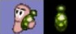
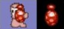

<!-- ##################################################################### -->

#  Bazooka

Arma predilecta de los gusanos que dispara un misil que estalla al impactar con un tiro parabólico.

Caracteristicas:
- Arma con mira: sí
- Combate cuerpo a cuerpo: no
- Disparo con potencia variable: sí
- Cuenta regresiva: no
- Teledirigido: no
- Trayectoria afectada por el viento: si
- Municiones: infinitas
- Daño: 50 pts (epicentro); 2 mts (radio)

#  Mortero

Es igual a la bazooka pero al estallar lanza fragmentos al aire con trayectoria parabólica que estallan al impactar.

Caracteristicas:
- Arma con mira: sí
- Combate cuerpo a cuerpo: no
- Disparo con potencia variable: sí
- Cuenta regresiva: no
- Teledirigido: no
- Trayectoria afectada por el viento: sí
- Municiones: 10
- Daño (del estallido principal): 50 pts (epicentro); 2 mts (radio)
- Daño (de cada fragmento): 10 pts (epicentro); 2 mts (radio)
- Cantidad de fragmentos: 6

#  Granada Verde

La segunda arma predilecta de los gusanos. Como otros tipos de granada no se ve afectada por el viento.

Caracteristicas: 
- Arma con mira: sí
- Combate cuerpo a cuerpo: no
- Disparo con potencia variable: sí
- Cuenta regresiva: sí
- Teledirigido: no
- Trayectoria afectada por el viento: no
- Municiones: infinitas
- Daño: 30 pts (epicentro); 2 mts (radio)

#  Granada Roja

Al igual que el Mortero, al explotar lanza fragmentos al aire con tiro parabólico que estallan al impacto.

Caracteristicas:
- Arma con mira: sí
- Combate cuerpo a cuerpo: no
- Disparo con potencia variable: sí
- Cuenta regresiva: sí
- Teledirigido: no
- Trayectoria afectada por el viento: no
- Municiones: 10
- Daño (del estallido principal): 30 pts (epicentro); 2 mts (radio)
- Daño (de cada fragmento): 10 pts (epicentro); 2 mts (radio)
- Cantidad de fragmentos: 6

#  Banana

Es un tipo de granada que tiene la particularidad de rebotar varias veces de forma muy elástica hasta explotar.

Caracteristicas:
- Arma con mira: sí
- Combate cuerpo a cuerpo: no
- Disparo con potencia variable: sí
- Cuenta regresiva: sí
- Teledirigido: no
- Trayectoria afectada por el viento: no
- Municiones: 5
- Daño: 70 pts (epicentro); 4 mts (radio)

#  Granada Santa

Una de las armas más poderosas en el arsenal. Justo antes de estallar, produce un sonido característico.

Caracteristicas:
- Arma con mira: sí
- Combate cuerpo a cuerpo: no
- Disparo con potencia variable: sí
- Cuenta regresiva: sí
- Teledirigido: no
- Trayectoria afectada por el viento: no
- Municiones: 2
- Daño: 110 pts (epicentro); 8 mts (radio)

#  Dinamita

Al activarse, el gusano deja en el lugar una dinamita que estalla luego de cierta cantidad de segundos.

Caracteristicas:
- Arma con mira: no
- Combate cuerpo a cuerpo: sí
- Disparo con potencia variable: no
- Cuenta regresiva: sí
- Teledirigido: no
- Trayectoria afectada por el viento: no
- Municiones: 5
- Daño: 50 pts (epicentro); 4 mts (radio)

#  Bate de Baseball

Al activarse el arma, el gusano batea lanzando a todo aquel cercano. La dirección de los gusanos lanzados dependerá de la dirección del bateo.

Caracteristicas:
- Arma con mira: sí
- Combate cuerpo a cuerpo: sí
- Disparo con potencia variable: no
- Cuenta regresiva: no
- Teledirigido: no
- Trayectoria afectada por el viento: no
- Municiones: infinitas
- Daño: 10 pts

#  Ataque Aereo

Caen del cielo 6 misiles hacia el objetivo marcado por el jugador cada uno de ellos explotando independientemente. Los misiles pueden impactar antes si se encuentran en su trayectoria con algún otro objeto.

Caracteristicas:
- Arma con mira: no
- Combate cuerpo a cuerpo: no
- Disparo con potencia variable: no
- Cuenta regresiva: no
- Teledirigido: sí
- Trayectoria afectada por el viento: sí
- Municiones: 2
- Daño (por cada misil): 40 pts (epicentro); 2 mts (radio)

#  Teletransportación

Al activarse la herramienta, el gusano puede teletransportarse a cualquier parte del escenario (salvo el interior de una viga).

Caracteristicas:
- Arma con mira: no
- Combate cuerpo a cuerpo: no
- Disparo con potencia variable: no
- Cuenta regresiva: no
- Teledirigido: sí
- Trayectoria afectada por el viento: no
- Municiones: infinitas
- Daño: ninguno

<!-- ##################################################################### -->
